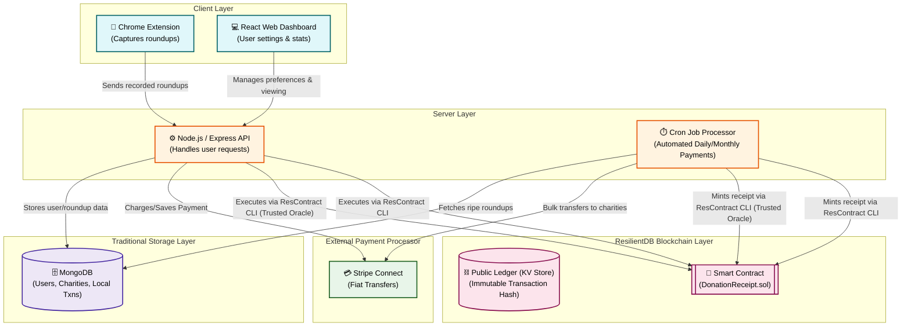

# Charitap Architecture Overview

This document provides a high-level architectural overview of the **Charitap** project, focusing on how different components interact to create a seamless, transparent micro-donation platform. Special attention is given to the integration of the **ResilientDB Blockchain**, highlighting where the public ledger and smart contracts fit into the workflow.

---

## 🏗️ High-Level Component Interactions

The following diagram illustrates the data flow and relationships between the Client, Server, Storage, Payment, and Blockchain layers.

---

## 🧩 The Core Layers Explained

### 1. Client Layer (Frontend)

- **Chrome Extension (`contentScript.js`, `background.js`)**: Tracks user purchases (e.g., $4.50 coffee) in real-time, calculating and buffering the $0.50 "round-up," then sending it to the backend.
- **React Web Dashboard**: Provides a unified user interface where donors can manage payment preferences (Threshold vs. Monthly), nominate new organizations, and visualize their charitable impact dynamically.

### 2. Server Layer (Backend)

- **Node.js / Express API**: A robust microservices-inspired API that handles user authentication, data fetching, and direct interactions with Stripe and ResilientDB.
- **Cron Job Processor (`node-cron`)**: A background schedule worker that evaluates users' accumulated "unpaid" round-ups every midnight in UTC (configured via system timezone / explicit TZ configuration). It checks if the threshold ($5.00) or monthly criteria are met, charging cards and initiating the blockchain verification sequences.

### 3. Traditional Data & Payments

- **MongoDB**: Serves as the primary mutable data store for user profiles, historical round-ups, and relational linkages between donors and charities.
- **Stripe Connect**: Responsible for the secure, fiat movement of funds. Users are charged comprehensively, and funds are automatically dispersed to connected charity accounts securely.

---

## ⛓️ Blockchain Integration (ResilientDB)

A critical focus of Charitap is resolving donor trust issues using **blockchain transparency**. ResilientDB operates in two parallel streams to ensure an immutable, cryptographically verifiable paper trail of every cent donated:

### A. The Public Ledger (Immutable Key-Value Store)

- **How it Works**: After a successful Stripe transfer, the backend (`resilientdb-client.js`) uses a deterministic hash (HMAC-SHA256 with a salt securely managed in a key vault/secrets manager, cached at runtime with a TTL instead of relying on environment variables) to map the donor's email to a `userId`. It then posts only the non-PII transaction receipt (Amount, Charity ID, Timestamp, userId) onto the ResilientDB KV mainnet via GraphQL. Raw or un-salted email values are never written to the public ledger.
- **Why it Matters**: It prevents tampered records. The blockchain guarantees that a donation made to a charity is publicly verifiable on-chain. The backend stores the ResilientDB on-chain transaction hash as `transactionId` in MongoDB, linking the two systems. Users can use this `transactionId` to query the public ledger directly and verify their donation independently. _Privacy Caveat: Even with an obfuscated `userId`, the combination of public fields (Amount, Timestamp, Charity ID) could allow for pattern analysis. Future mitigations under consideration include amount padding, transaction batching, or intentional timestamp delays._

### B. Smart Contracts (`DonationReceipt.sol`)

- **How it Works**: Handled by `rescontract-client.js`. Alongside the base ledger log, Charitap leverages a Solidity smart contract (`DonationReceipt.sol`) deployed directly on the ResilientDB network. The backend invokes contract functions via the `contract_service_tools` CLI wrapper.
  - `mintReceipt(uint256 charityId, uint256 amountCents)`: Creates a formalized cryptographic receipt. Access is restricted by the `onlyOwner` key held securely by the backend, meaning receipts can be fabricated if that key is compromised. Input validation requires `amountCents > 0` and ensures `charityId` is a registered valid ID. The backend handles anti-replay by validating unique transaction IDs prior to minting.
  - `getTotalByCharity(uint256 charityId)`: Aggregates on-chain state directly from the smart contract layer, independent from MongoDB.
- **Trust Assumptions**: Only the backend private key can call `mintReceipt(uint256 charityId, uint256 amountCents)`. The contract does not independently verify off-chain payments (e.g., Stripe/MongoDB) when minting. There is a risk of key compromise or insider abuse. Future mitigation options include multisig or decentralized governance for the owner role. The contract is designed as an immutable singleton to guarantee the finality of operations, but its integrity relies heavily on the backend protecting the private key.
- **Why it Matters**: Smart contracts enforce programmable trust. The `DonationReceipt` acts as a trustless smart-escrow log, meaning neither Charitap nor the charities can inflate or deny donation histories—it is mathematically bound to the source code execution.

### C. Off-Chain Security Flaws & Trust Boundaries

While the blockchain guarantees the immutability of the final donation record, the **off-chain** data entry and processing layers still require trust:

- **Extension/Browser Compromise**: The Chrome extension operates in the browser environment, which is susceptible to malware or other rogue extensions manipulating the DOM before the round-up payload is captured.
- **Server Middleware Trust**: Charitap's backend acts as an oracle to ResilientDB. If the Node.js API environment is compromised, bad actors could forge round-up amounts before they reach the blockchain. The `transactionId` linkage relies on the centralized server posting honest receipts.
- **Stripe Fiat Dependency**: Actual fund settlement is completely reliant on Stripe. While ResilientDB tracks the _logical_ allocation of funds, the _physical_ fiat deposit into charity bank accounts is subject to traditional banking rails and delays.
